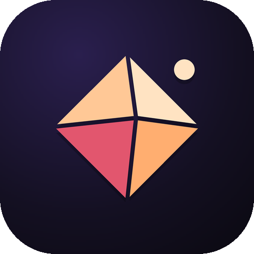

# SOLO

A premium music player for Android, built with Jetpack Compose. Search and play any song for free, with no account required.

## Features

- 🖼️ **Image-forward home**: a featured artwork carousel leads Home, with larger covers across richer shelves and bold mood/genre/chart tiles on Explore, so the whole app leans on real artwork and premium art accents.
- ✨ **Premium motion**: tasteful screen transitions, animated play/pause and like, list enter animations, shimmer on load, and a live now-playing equalizer glyph on the mini player — all tuned to feel smooth, not flashy.
- ⚡ **Smoother, instant playback**: upcoming songs are resolved and pre-buffered with a deeper lookahead and a tuned buffer, so tracks start right away and keep playing through weak connections without stutter.
- 🎧 **High-quality audio by default**: the best Opus/AAC stream, and FLAC for your local and downloaded files.
- 🧠 **Personalised trending and recommendations**: an on-device taste engine (plays, skips, likes, recency, artist affinity) reads your listening context — time of day and session — so even the trending feed is reordered to your taste while still surfacing genuinely fresh discovery, with mood clustering, stronger diversity and no recent repeats.
- 🌅 **Mix for you**: a fresh daily mix, plus "Jump back in", a "Because you liked …" shelf, your top artists and new personalised shelves.
- 🔗 **Share with artwork**: share a song as a cover-art card, with a text link fallback.
- 🎵 **Free search and play**: find any song and play it, with no login.
- 🎚️ **Equalizer, speed and pitch, volume normalization**, crossfade with DJ-style mixing, downloads and offline caching.
- 📝 **Lyrics**: synced lyrics with a live preview on the player, a full-screen view and on-device translation.
- 📀 **Spotify (optional)**: sign in to bring your playlists, liked songs, followed artists, history and recommendations.
- ✨ **"Aurora Noir" design**: a warm obsidian canvas with one electric lime-citron "Volt" accent and a layered surface ramp, set in Space Grotesk and Plus Jakarta Sans, with an artwork-tinted player and a docked glass tab bar.

The icon is the **Spotlight O**: an original mark built as a Volt-gradient notched ring — the "O" of SOLO — with a single bright dot at its centre, like a lone voice caught under a spotlight. It reads clearly from the launcher down to the small notification icon.

See [CHANGELOG.md](CHANGELOG.md) for everything new in 6.0.0.

## Install

Download the latest APK from [Releases](https://github.com/wintontomlinson/Spotui/releases) and sideload it (Android 8.0 or later). Allow "install from unknown sources" when asked.

SOLO keeps the package name of earlier Sonvra, Solo and Spotui builds, so it installs over them and keeps your library, likes, downloads, settings and Spotify login.

If Android refuses to install the APK, uninstall any copy that came from a different source, download the APK again in full, and allow the install when Play Protect asks.

## Credits

SOLO builds on these open-source projects:

- [Neptune](https://github.com/navneet851/spotify-clone-jetpack-compose): the original Jetpack Compose music player this app started from.
- [Metrolist](https://github.com/MetrolistGroup/Metrolist): the YouTube Music streaming internals (InnerTube client, stream cipher and PoToken handling).
- [SpotiFLAC](https://github.com/spotbye/SpotiFLAC): lossless (FLAC) track resolving.
- [SimpMusic](https://github.com/maxrave-dev/SimpMusic): crossfade and DJ-style audio filter processing.
- [Space Grotesk](https://github.com/floriankarsten/space-grotesk) and [Plus Jakarta Sans](https://github.com/tokotype/PlusJakartaSans): typefaces under the SIL Open Font License 1.1 (see [`licenses/fonts`](licenses/fonts)).

Maintained by **SATYAN SHARMA**.

## License

SOLO is free software released under the [GNU General Public License v3.0](LICENSE).

## Disclaimer

This project is for educational purposes only. Spotify is a trademark of Spotify AB and YouTube is a trademark of Google LLC. SOLO is not affiliated with, or endorsed by, either company.
